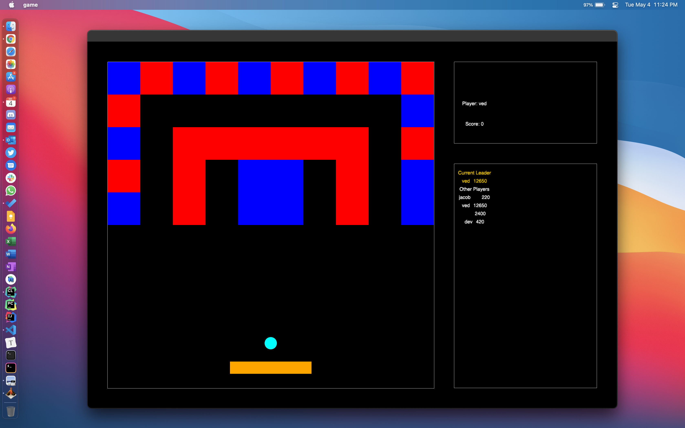
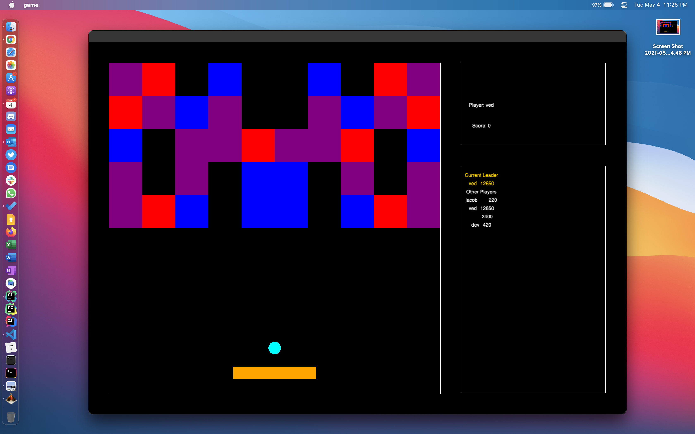

# Brick and Ball

Brick and Ball is an adaptation of the classic Black Berry game in which your objective is to destroy all the brick in the level by projecting the ball at them, a sufficient number of times. When all the blocks are destroyed, the level is complete. 

This version of the game also includes player profiles, leaderboards, multiples levels and custom background colours, all written in C++ using the cinder library.

## Dependencies:
[cMake](https://cmake.org/)

[Cinder](https://libcinder.org/docs/guides/tour/hello_cinder_chapter3.html)

## Set Up
Once you have set up and built CMake and Cinder, clone the repository inside the cinder folder and then run the `game` configuration. 
All testing was done on Mac Os Big Sur.

## Controls

### Game Controls

| Control     | Action                   |
|-------------|--------------------------|
| Left Arrow  | Move paddle to the left  |
| Right Arrow | Move paddle to the right |
| Space Bar   | Launch Ball              |

### Level Controls

| Control | Action          |
|---------|-----------------|
| 0       | Level 0 - empty |
| 1       | Level 1         |
| 2       | Level 2         |
| 3       | Level 3         |
| 4       | Level 4         |

### Style Controls

| Control | Action          |
|---------|-----------------|
| 6       | Black Background|
| 7       | Green Background|
| 8       | Teal Background |

